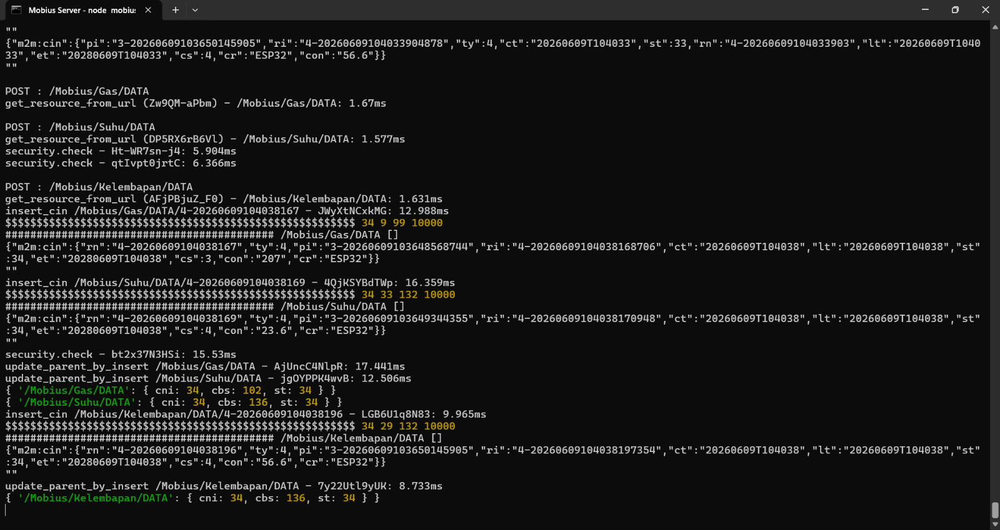
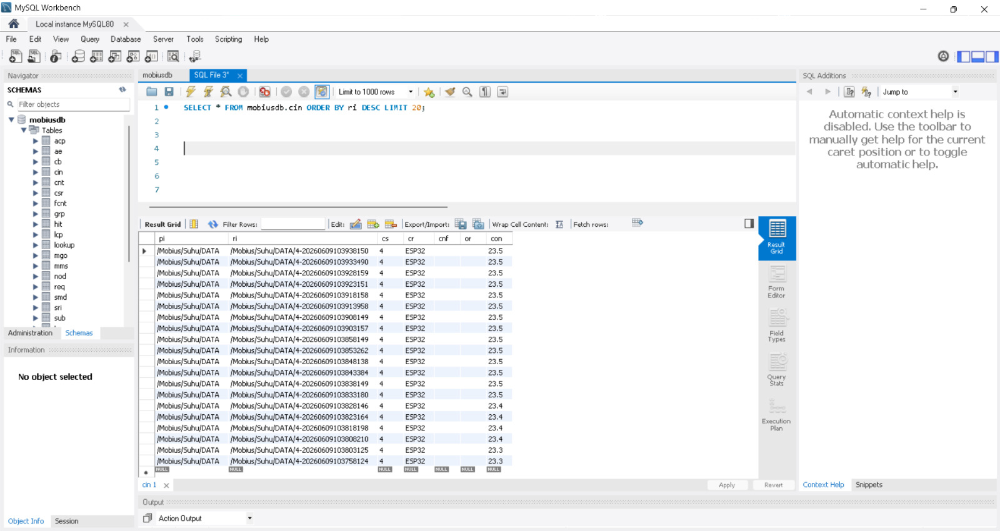
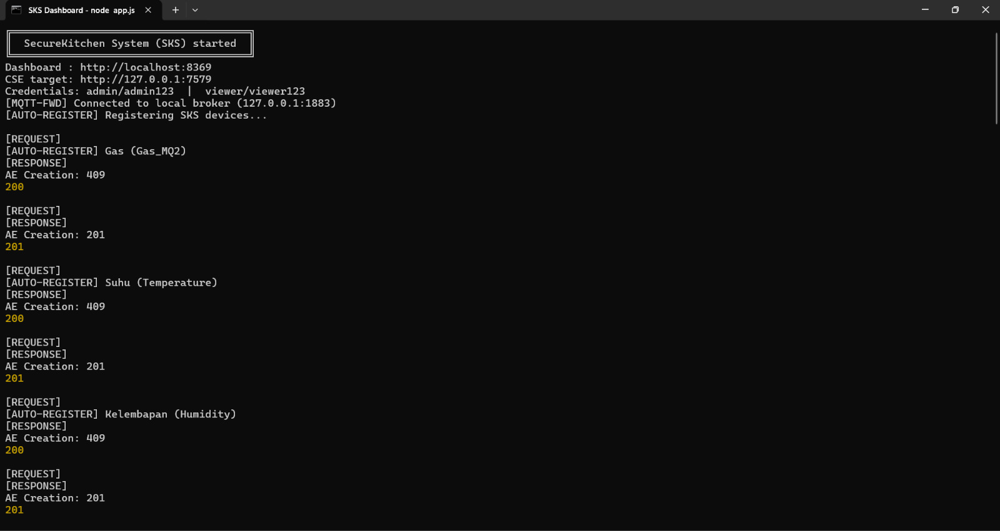
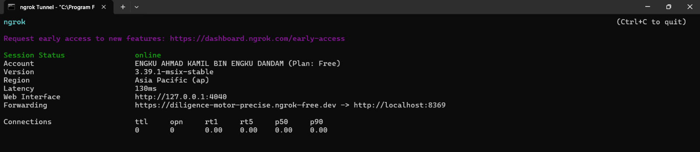
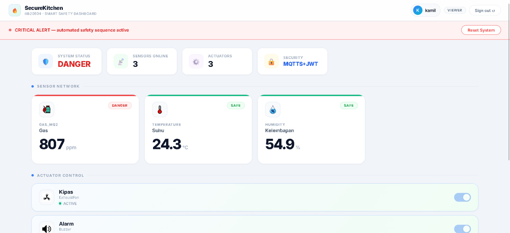
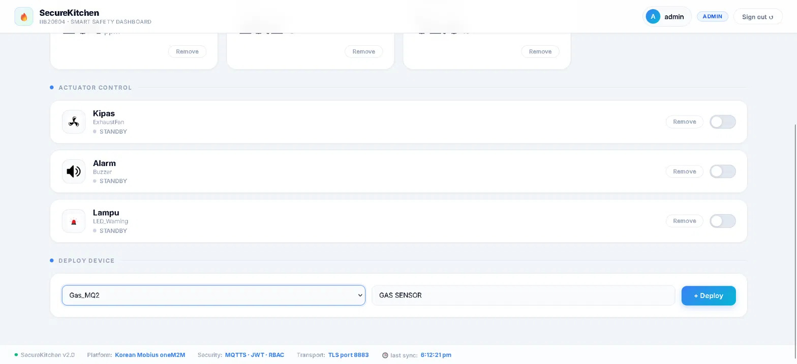
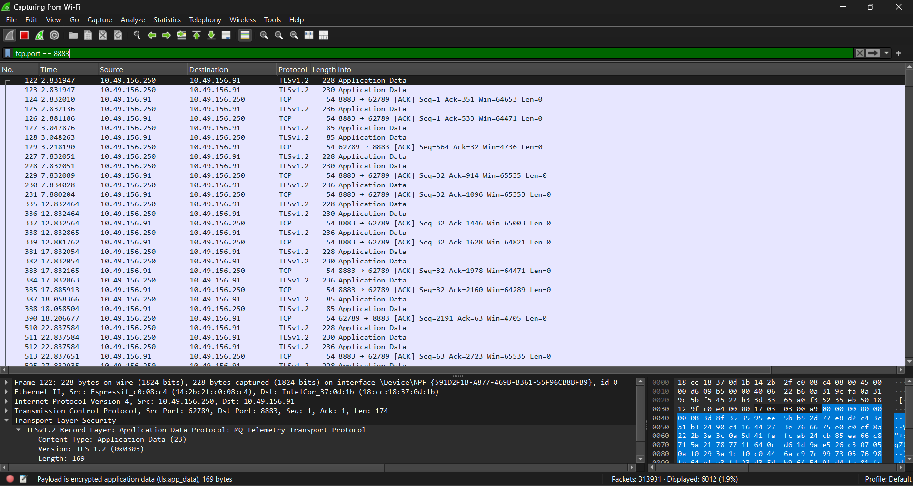

# SecureKitchen System (SKS)

### IIB20804 IoT Application Security — Mini Project

---

## Team — Mar26_SecureKitchen System (SKS)

| Name | Student ID | Role |
|------|-----------|------|
| Engku Ahmad Kamil Bin Engku Dandam | 52224224256 | Leader |
| Nur Izzah Binti Mohd Razali | 52224224189 | Member |
| Fatin Farzana Binti Faizal | 52224224051 | Member |
| Nurin Irdina Binti Hj.Saiful Bahri | 52224224328 | Member |

---

## System Overview

SecureKitchen is an IoT-based smart kitchen safety monitoring system that detects gas leaks, high temperature, and abnormal humidity. It uses an ESP32 microcontroller with MQ-2 and DHT22 sensors, communicates over **MQTTS (TLS port 8883)**, stores data on a **Mobius oneM2M platform**, and displays live data on a **Node.js dashboard** protected by JWT authentication and RBAC. The dashboard is exposed publicly via **ngrok HTTPS**.

### System Architecture


---

## Hardware Requirements

| Component | Pin |
|-----------|-----|
| MQ-2 Gas Sensor (AO) | GPIO 34 |
| DHT22 Temperature & Humidity | GPIO 4 |
| Relay — Exhaust Fan | GPIO 26 |
| Relay — Buzzer | GPIO 27 |
| NeoPixel LED Strip (8 LEDs) | GPIO 13 |

---

## Software Requirements

- Node.js v18+
- MySQL (for Mobius)
- Mosquitto MQTT Broker v2.1+
- ngrok (for HTTPS public access)
- Arduino IDE 2.x
- Arduino Libraries:
  - WiFi
  - WiFiClientSecure
  - PubSubClient
  - DHT
  - ArduinoJson
  - Adafruit_NeoPixel

---

## Setup Instructions

### Step 1 — Start Mosquitto with MQTTS

Edit:

```text
C:\Program Files\mosquitto\mosquitto.conf
```

```conf
listener 1883
allow_anonymous true

listener 8883
cafile C:\path\to\Mobius-master\mobius\ca-crt.pem
certfile C:\path\to\Mobius-master\mobius\server-crt.pem
keyfile C:\path\to\Mobius-master\mobius\server-key.pem
allow_anonymous true
```

Start Mosquitto:

```bash
net start mosquitto
```

---

### Step 2 — Start Mobius oneM2M Server

```bash
cd Mobius-master
node mobius.js
```

Wait until you see:

```text
mobius server running at 7579 port
sgn_mqtt_client is connected
```

### Mobius Startup



### Mobius Monitoring


### Mobius Database



---

### Step 3 — Install SKS Dependencies

```bash
cd SKS
npm install
```

---

### Step 4 — Configure SKS

Edit:

```text
config/default.json
```

```json
{
  "cse": {
    "ip": "127.0.0.1",
    "port": 7579,
    "id": "Mobius",
    "name": "Mobius",
    "release": "1",
    "acp_required": false
  },
  "app": {
    "ip": "YOUR_PC_IP",
    "port": 8369
  }
}
```

Replace `YOUR_PC_IP` with your actual IP address.

---

### Step 5 — Start SKS Dashboard

```bash
node app.js
```

Expected output:

```text
SecureKitchen System (SKS) started
Dashboard : http://localhost:8369
CSE target: http://127.0.0.1:7579
[MQTT-FWD] Connected to local broker (127.0.0.1:1883)
[AUTO-REGISTER] Gas → 201
[AUTO-REGISTER] Suhu → 201
[AUTO-REGISTER] Kelembapan → 201
```

### Dashboard Startup



---

### Step 6 — Expose Dashboard via ngrok (HTTPS)

#### Install ngrok

Download from:

```text
https://ngrok.com/download
```

#### Run ngrok

```bash
ngrok http 8369
```

Example:

```text
Forwarding https://abcd1234.ngrok-free.app → http://localhost:8369
```

### ngrok HTTPS Tunnel



#### Share with Lecturer

```text
https://abcd1234.ngrok-free.app
```

> Note: The ngrok URL changes every time you restart ngrok.

> Note: Keep `app.ip` as your local private IP address.

---

### Step 7 — Flash ESP32

Open:

```text
SKS_ESP32/SKS_ESP32.ino
```

Update:

```cpp
const char* WIFI_SSID     = "YOUR_WIFI_NAME";
const char* WIFI_PASSWORD = "YOUR_WIFI_PASSWORD";
const char* MQTT_BROKER   = "YOUR_PC_IP";
```

Upload to ESP32.

Serial Monitor:

```text
[WiFi] Connected! IP: 10.x.x.x
[MQTT] Connected via MQTTS!
[SENSOR] Gas: 160 ppm | Temp: 32.0 C | Hum: 69.5%
[MQTT] Gas = 160 → OK
```

---

## Login Credentials

| Role | Username | Password | Permissions |
|------|----------|----------|-------------|
| Admin | admin | admin123 | Full access |
| Viewer | viewer | viewer123 | Read-only |

### Dashboard Login Interface



---

## Devices

| Dashboard Name | Type | Direction |
|---------------|------|-----------|
| Gas | Gas_MQ2 | Sensor (up) |
| Suhu | Temperature | Sensor (up) |
| Kelembapan | Humidity | Sensor (up) |
| Kipas | ExhaustFan | Actuator (down) |
| Alarm | Buzzer | Actuator (down) |
| Lampu | LED_Warning | Actuator (down) |

### Live Monitoring Dashboard



---

## Security Features

### 1. MQTTS — TLS Encrypted MQTT (Port 8883)

- ESP32 uses WiFiClientSecure
- Sensor data encrypted with TLS
- Standard MQTTS port 8883
- Verified using Wireshark

#### Wireshark Verification



---

### 2. HTTPS via ngrok

- Dashboard accessible through HTTPS
- TLS encrypted connection
- No direct port exposure

---

### 3. JWT Authentication

- Every API request requires JWT
- Authorization header required
- Token expiry: 8 hours
- Login endpoint: `POST /login`

---

### 4. Role-Based Access Control (RBAC)

#### Admin
- View devices
- Add devices
- Delete devices
- Control actuators
- Reset alarm

#### Viewer
- View-only access
- Cannot modify system

---

### 5. Alarm Auto-Trigger Logic

| Sensor | Safe | Warning | Danger |
|----------|----------|----------|----------|
| Gas (MQ-2) | < 299 ppm | 299–499 ppm | ≥ 500 ppm |
| Temperature | < 38°C | 38–39.9°C | ≥ 40°C |
| Humidity | < 85% | 85–94.9% | ≥ 95% |

When a danger threshold is exceeded:

- Exhaust fan turns ON
- Buzzer activates
- Warning LED turns RED
- Dashboard displays DANGER status

### Safe State


### Warning State


---

### 6. oneM2M Platform (Mobius)

- Application Entities (AE)
- ContentInstances
- Subscriptions
- Command containers
- Port 7579

---

## API Endpoints

| Method | Endpoint | Auth | Role | Description |
|----------|----------|----------|----------|----------|
| POST | /login | No | Any | Get JWT token |
| GET | /me | JWT | Any | Current user |
| GET | /devices | JWT | Any | Device list |
| POST | /devices | JWT | Admin | Add device |
| POST | /devices/:name | JWT | Admin | Control actuator |
| DELETE | /devices/:name | JWT | Admin | Delete device |
| GET | /alarm | JWT | Any | Alarm status |
| POST | /alarm/reset | JWT | Admin | Reset alarm |
| GET | /templates | JWT | Any | Device templates |

---

## MQTTS Topics

| Topic | Direction | Description |
|----------|----------|----------|
| `/oneM2M/req/ESP32/Mobius2/json` | ESP32 → Mobius | Sensor data |
| `/oneM2M/req/Mobius2/ESP32/json` | Mobius → ESP32 | Commands |

---

## Quick Start

Run:

```bash
start_SKS.bat
```

This automatically:

1. Starts Mosquitto Broker
2. Starts Mobius Server
3. Starts SKS Dashboard
4. Opens browser

Then run:

```bash
ngrok http 8369
```

Share the generated HTTPS URL with your lecturer.

---

## Project Demonstration Screenshots

| Feature | Screenshot |
|----------|----------|
| System Architecture | ✅ |
| Dashboard Login | ✅ |
| Dashboard Monitoring | ✅ |
| Safe State | ✅ |
| Warning State | ✅ |
| Wireshark TLS Verification | ✅ |
| ngrok HTTPS Tunnel | ✅ |
| Mobius Server | ✅ |
| Mobius Monitoring | ✅ |
| Mobius Database | ✅ |
| Dashboard Startup | ✅ |

---
